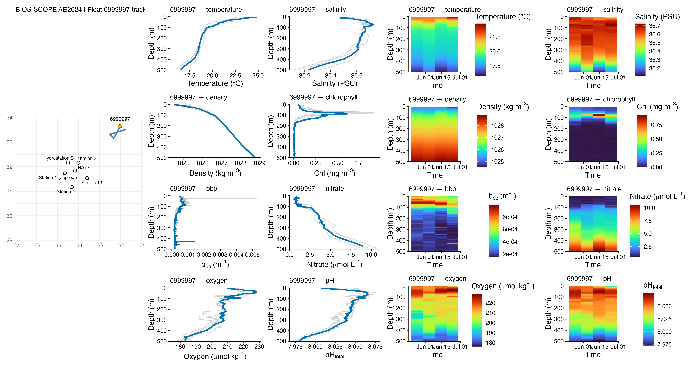

# BIOS-SCOPE 2026 Cruise Context

Current environmental context for BIOS-SCOPE cruise AE2624 aboard the R/V *Atlantic Explorer* in October 2026. This repository is intended primarily for cruise participants to view recent satellite and autonomous-float conditions near the planned work area.

## Latest conditions

- [Latest PACE satellite products](figs/latest_sat/)
- [Latest Argo float products](figs/latest_float/)
- [All dated figure archives](figs/README.md)

### PACE chlorophyll

The map below is the latest rolling 8-day median of PACE OCI chlorophyll. Cruise stations are overlaid for geographic context.

### Argo float context

The float composites include recent tracks, vertical profiles, and time-depth fields for available Core Argo, BGC-Argo, and Deep Argo floats near the study region.

## Planned station region

The detailed PACE map covers `(west, south, east, north)`:

`(-64.80, 31.00, -63.40, 32.35)`

Station coordinates are stored in [`data/station_locations.csv`](data/station_locations.csv). West longitudes are negative.

| Station | Latitude | Longitude | Status |
|---|---:|---:|---|
| BATS | 31.833333 | -64.166667 | Planning coordinate |
| Hydrostation S | 32.166667 | -64.500000 | Venter et al. (2004), supporting Table S1 |
| Station 13 | 31.535000 | -63.595000 | Venter et al. (2004), supporting Table S1 |
| Station 11 | 31.175000 | -64.324333 | Venter et al. (2004), supporting Table S1 |
| Station 3 | 32.158500 | -64.010167 | Venter et al. (2004), supporting Table S1 |
| Station 1 | 31.750000 | -64.650000 | Approximate, not reported in Venter et al. (2004) |

## How the figures are produced

- PACE composites are generated in the CryoCloud Jupyter environment using the maintained 8-day notebook. A snapshot of that notebook is retained in [`notebooks/BIOSSCOPE_AE2624_PACE_CHL_Last8Days.ipynb`](notebooks/BIOSSCOPE_AE2624_PACE_CHL_Last8Days.ipynb) for provenance.
- Argo context figures are generated with [`scripts/BIOSSCOPE_AE2624_argoFloats_context.Rmd`](scripts/BIOSSCOPE_AE2624_argoFloats_context.Rmd). The workflow searches both the Core/Deep and synthetic BGC indices, preferring synthetic profiles when the same float appears in both.
- [`scripts/update_fig_index.R`](scripts/update_fig_index.R) refreshes the dated archives and `latest` figure folders.
- Raw downloaded Argo files remain local under `data/argo/` and are not included in Git.

The generated PNG files are intended for quick viewing and insertion into cruise-planning documents. Matching PDFs preserve higher-quality text and station symbols.

## Credits

- Argo profile discovery, retrieval, quality control, and processing use the [ArgoCanada `argoFloats` R package](https://github.com/ArgoCanada/argoFloats), developed by Dan Kelley, Jaimie Harbin, and Clark Richards.
- The PACE workflow was developed with resources and examples from the [2025 PACE Data Hackweek](https://pacehackweek.github.io/pace-2025/intro.html).
- Satellite observations are from NASA PACE OCI; float observations are provided by the international Argo Program and its contributing national programs.
